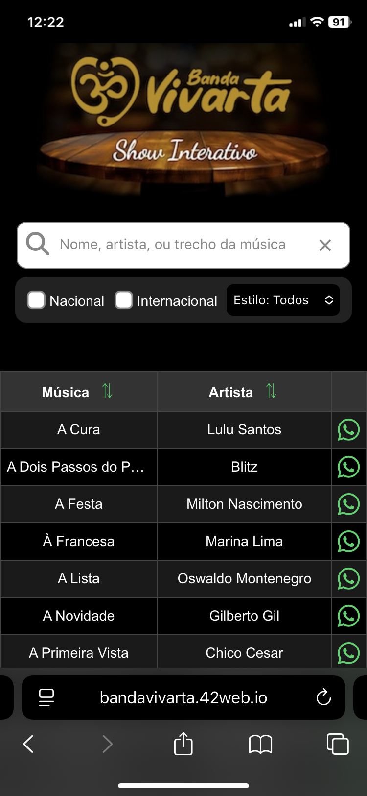
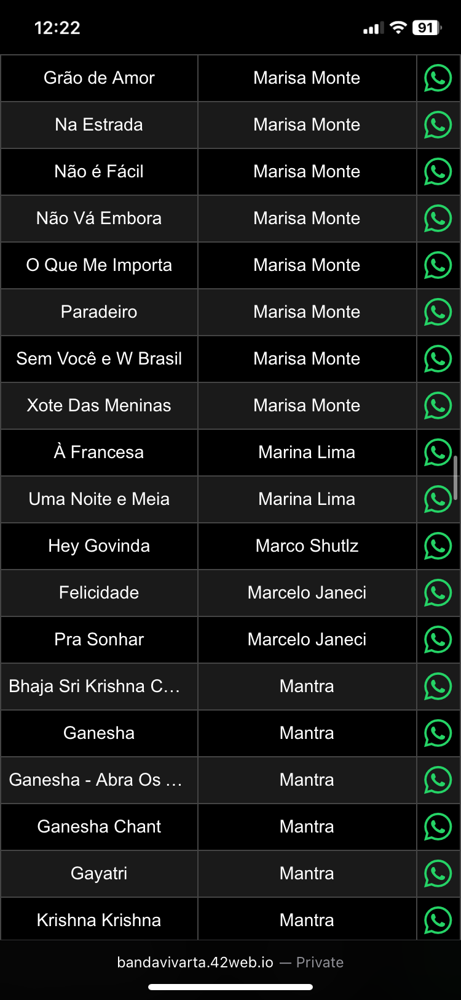
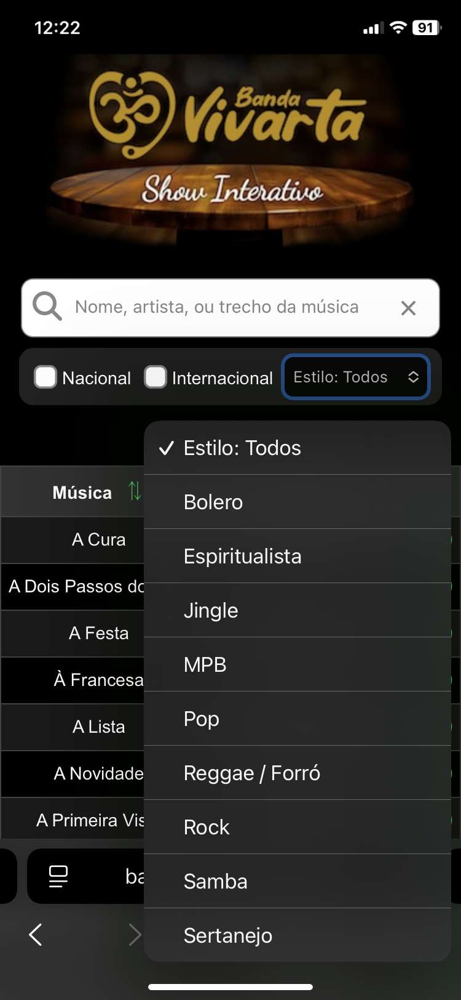
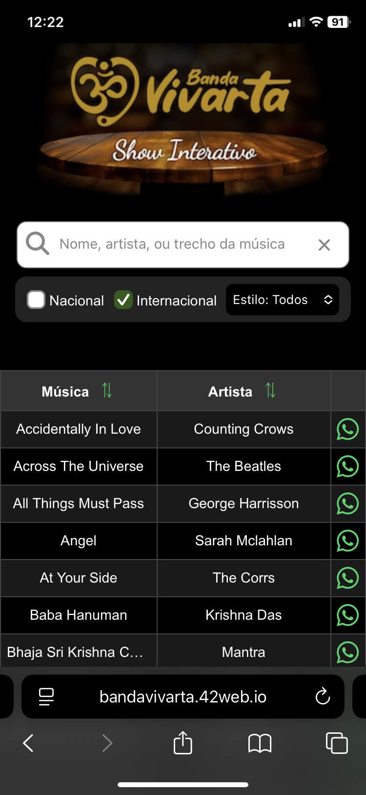

# Menu Musical – Demonstração

🚫 **Este repositório é demonstrativo. O uso, cópia ou redistribuição sem autorização explícita é proibido.**  
© Mollitiam Development.

## Sobre o Site

O **Menu Musical** é uma página com o principal objetivo a adaptação na interação entre o público e o músico, criando um show interativo. A página consta todo o repertório da banda, e o público pode pesquisar pelo nome, artista ou por trechos da música. Além disso, a aplicação de filtros por gêneros, “nacionais" ou “internacionais” facilita a busca. Assim que encontrar a música que deseja ouvir, é só clicar no ícone do WhastApp e enviar diretamente ao músico.

## Funcionalidades Principais

- Busca dinâmica de músicas (nome, artista, trecho)
- Filtros por nacionalidade e gênero musical
- Solicitação de músicas via WhatsApp
- Interface responsiva e dark mode
- Integração social (Instagram)

## Technical Overview

- **Linguagens:** HTML5, CSS3, JavaScript
- **Backend:** PHP, MySQL
- **Arquitetura:** Estrutura modular (assets, scripts, backend)
- **Funcionalidades:** Busca e filtros em tempo real, integração WhatsApp, responsividade
- **Integração:** API RESTful simples via PHP, WhatsApp, Instagram

## 📱 Screenshots

### 1. Tela Inicial

### 2. Tabela de Pesquisa

### 3. Gêneros Musicais

### 4. Filtros

---

## Contato

Para mais informações, entre em contato:  
https://mollitiamdevelopment.great-site.net 
