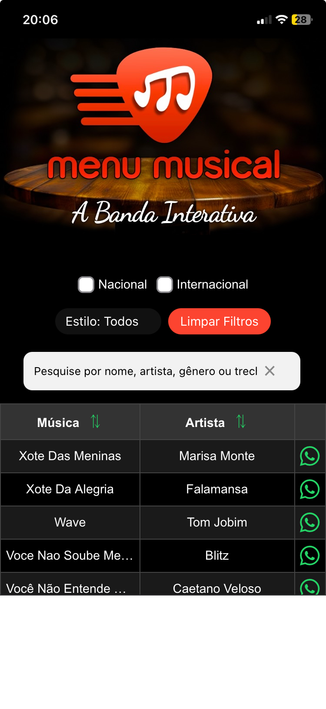

<h1 align="center"> Menu Musical </h1>

  <a href="#-tecnologias">Tecnologias</a>&nbsp;&nbsp;&nbsp;|&nbsp;&nbsp;&nbsp;
  <a href="#-projeto">Projeto</a>&nbsp;&nbsp;&nbsp;|&nbsp;&nbsp;&nbsp;
  <a href="#memo-licença">Licença</a>

  

 

  

## 🚀 Tecnologias

Esse projeto foi desenvolvido com as seguintes tecnologias:

- HTML, CSS, JavaScript e PHP

## 💻 Projeto

Menu Musical. Uma página onde se pode interagir com o músico pedindo a ele que toque suas músicas preferidas, sem utilizar aquele método arcaico de escrever um bilhete no guardanapo ou então pedir ao garçom que entregue recados.
Você pode pesquisar pelo nome da música, artista ou até por trechos da música. Pode também filtrar entre musicas "Nacionais", "Internacionais" ou aplicar os filtros de gêneros musicais. Assim que encontrar a música que deseja ouvir, é só clicar no ícone do WhastApp e enviar diretamente ao músico.

## 📝 Licença

Esse projeto está sob a licença MIT.

---"#MenuMusical" 
